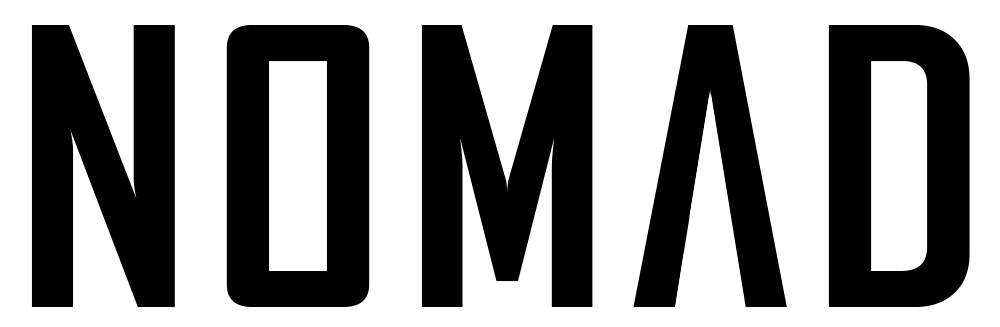
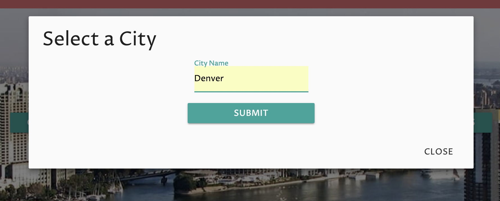
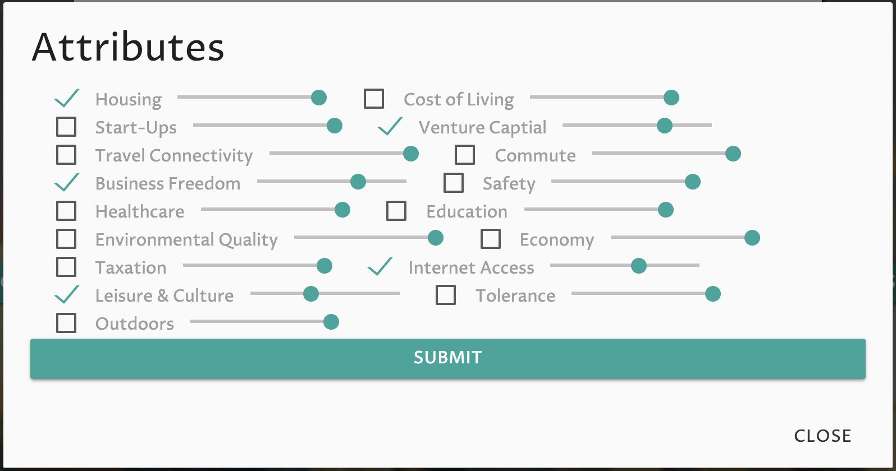
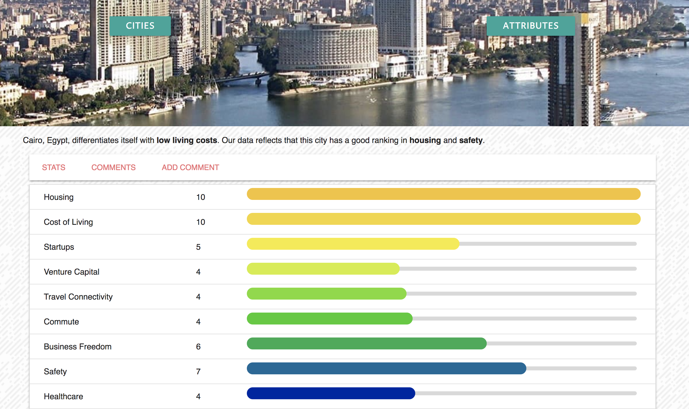
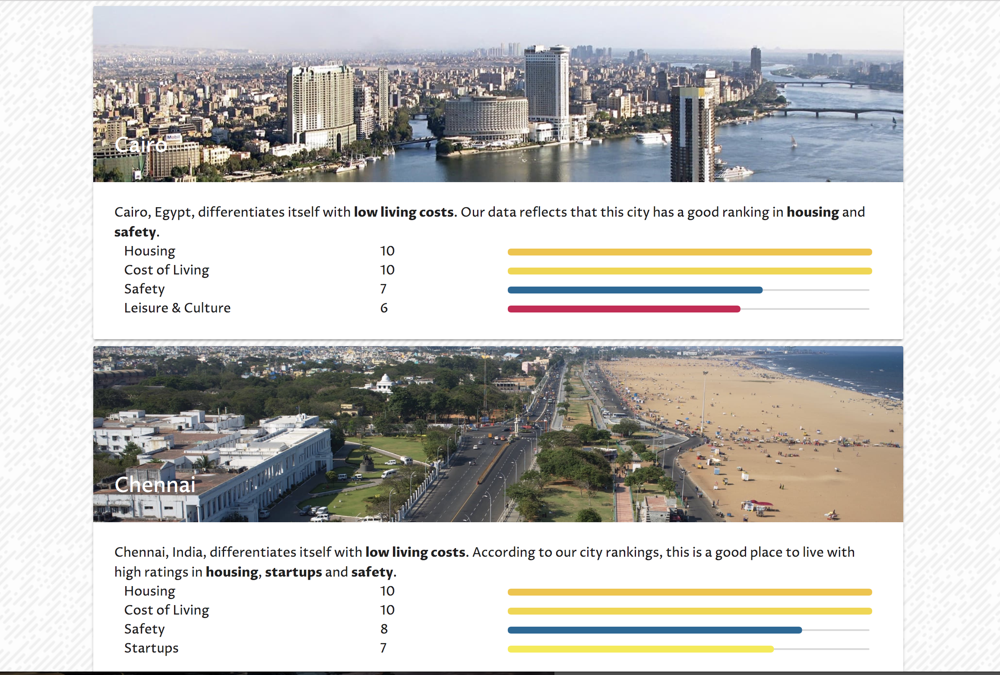

----
Nomad is a Full Stack React City search project which enables users to find useful information about cities they search for either by name or by attributes they are looking for in a city. Users can also comment on cities and up-vote or down-vote other users comments, adding a community to an otherwise data-driven site.

Search By either City name or city attributes:

Name Search                                  |  Attribute Search
:-------------------------------------------:|:------------------------------------------------------:
  |  

Result:                                      | Result:
:-------------------------------------------:|:------------------------------------------------------:
     |  

##### Future Goals:
  * More Error Handling
  * Show spinner while waiting for API Response
  * Favorite cities
  * Civic Data for cities
  * More Commute/Walkabilty Data
  * More Climate Data

## This Project was developed by
* Daniel Shikoff [Github](https://github.com/dmshikoff)
  * Setup the Backend routes and authorization
  * Responsible for CSS design and Materialize framework
  * Controlled all Modals and user sign-in/sign-up operations
  * Changed content on the page as LocalStorage was created and updated
  * Task Manager
* Abe Queen [Github](https://github.com/abedababe8)
  * Implemented Redux
  * Rendered Components based on API data
  * Managed Redux store state and application state
  * Managed API integration
  * Data display and Line-Graph Setup
